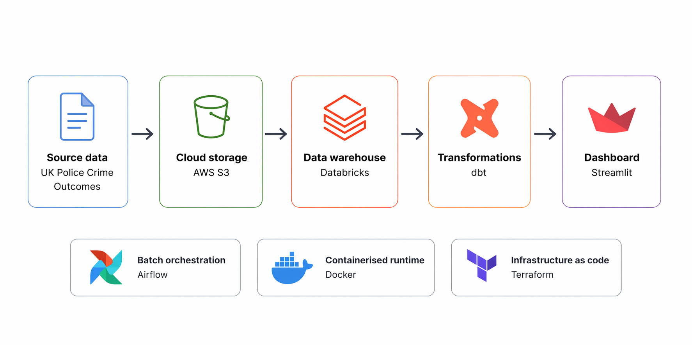

# sheffield-crime-outcomes
Data Zoomcamp Final Project 2026

**Contents:**
- Problem Description
- Project overview
- Reproducibility Guide 

# Problem Description

Crime data in Sheffield provides valuable insights into patterns, locations, and outcomes of offences. However, this data is typically released as large, raw datasets that are not easily accessible or interpretable for non-technical users.

Users need a way to:

- Explore crime trends over time
- Compare different crime types and locations
- Understand how crime outcomes vary across categories
- Interact with data without requiring advanced analytical skills

This project addresses these challenges by transforming raw Sheffield crime data into an interactive dashboard, enabling users to explore patterns and outcomes through intuitive visualisations and filters.

# Project Overview

The dataset used in this project is sourced from the UK Police open data platform (https://data.police.uk/docs). The system is designed to ingest and store raw crime data in a scalable cloud environment, orchestrate data workflows through automated pipelines, and transform the data into structured, analytics-ready models. These processed datasets are then presented through an interactive dashboard, enabling users to explore crime patterns and outcomes in a clear and user-friendly way.

The project follows a modern data engineering architecture:

- Infrastructure as Code using Terraform to provision cloud resources
- Orchestration with Airflow and Docker to manage data pipelines
- Cloud storage and processing on AWS and Databricks
- Transformations implemented with DBT to create clean, reusable datasets
- Visualisation through a Streamlit dashboard for interactive analysis



The choice of tooling was influenced by the technologies used in my company, with the aim of gaining practical experience in these specific tools. As a result, this project incorporates tools such as Apache Airflow, AWS, and Databricks. As these were not covered in the course materials, additional effort has been made to explain and document these technologies.

## Infrastructure as Code

The infrastructure for this project is managed using Terraform to ensure the cloud environment is reproducible, version-controlled, and easy to deploy. It provisions the core AWS and Databricks resources required for the pipeline, including S3 storage for raw data, IAM roles and policies for secure access, and Databricks resources for working with the data through Unity Catalog. The configuration is parameterised using variables, allowing deployment settings to be easily adapted across environments.

### Terraform

The Terraform configuration is structured across main.tf, variables.tf, terraform.tfvars.example, and outputs.tf. A key aspect of the implementation is the two-stage trust configuration between AWS and Databricks. The process begins with a bootstrap external ID to create the IAM role and storage credential, which is then updated with the actual external ID generated by Databricks. This enables a secure trust relationship before creating the external location and applying permissions. This staged approach is necessary because part of the final configuration depends on values that are only available after the initial resources have been created.

> [!NOTE]
> **Deployment Approach**  
> The `deploy.sh` script is included to handle the multi-stage Terraform deployment required for the AWS–Databricks integration. Because the Databricks external ID is only generated after initial resource creation, the infrastructure cannot be provisioned in a single step. The script automates this staged process, reducing manual intervention and ensuring the deployment is repeatable and less error-prone.

## Batch Data Ingestion 

This project implements a batch data pipeline orchestrated using Docker and Apache Airflow in a reproducible local environment. Docker provides consistent runtime environments for both Airflow and Streamlit, while Airflow manages the scheduled, sequential execution of ingestion, loading into the data lake (S3), and downstream transformations in Databricks using dbt.

### Docker

Docker is used to package the orchestration and dashboard environments so the project can be run with a consistent set of dependencies. The Airflow service is built from a custom Dockerfile based on apache/airflow:2.10.5-python3.12, installs supporting system packages, uses uv to create the project environment, and copies in the application code, dbt project, DAGs, and entrypoint script. The entrypoint then exposes the project virtual environment on the PATH before starting Airflow. 

In the provided compose setup, the Airflow container runs airflow standalone, mounts the DAG, app, and dbt directories, and receives AWS and Databricks credentials through environment variables. A second container runs the Streamlit dashboard, allowing both orchestration and visualisation to be launched together in a local development environment

### Workflow Orchestration with Airflow

> [!NOTE]
> **Apache Airflow** is an open-source workflow orchestration tool used to define, schedule, and monitor data pipelines. Pipelines are represented as Directed Acyclic Graphs (DAGs), where each task has explicit dependencies. In this project, Airflow is used to automate the end-to-end data pipeline, ensuring that ingestion, loading, and transformation steps run in the correct order.

The workflow is defined in airflow/dags/sheffield_crime_pipeline.py as a monthly scheduled DAG called sheffield_crime_pipeline. It orchestrates the pipeline using a series of BashOperator tasks that run each stage sequentially: data ingestion, loading into Databricks, and transformation with dbt. A final done task marks successful completion. The linear dependency structure (ingest → load → transform) mirrors the data flow and keeps the orchestration logic simple and easy to follow.

The DAG executes Python scripts located in the app/ directory:

- ingest.py: Retrieves data from the UK Police API (crimes-street/all-crime and outcomes-at-location) using the latitude and longitude for Sheffield and a list of specified year-month values. The data is serialised as JSON and uploaded to S3 using partitioned paths (e.g. police/raw/<dataset>/date=<YYYY-MM>/...) to create a structured raw data layer.
- load_to_databricks.py: Connects to Databricks using the SQL connector, creates Delta tables in workspace.src_police if they do not already exist, and loads the JSON data from S3 into these tables. It enriches the data with metadata fields such as ingest_year_month and loaded_at, and performs basic transformations on nested fields before insertion.

## Cloud-based Architecture

This project uses a cloud-based architecture that separates storage and compute, improving scalability, flexibility, and reproducibility. This approach aligns with modern data engineering best practices, as it enables independent scaling of storage and processing, improves cost efficiency, and allows the pipeline to evolve as data volume and complexity increase.


### AWS (S3 Data Lake)

Amazon S3 is used as the storage layer for the pipeline. It provides scalable object storage for large volumes of unstructured data and removes the need for managing on-premise infrastructure.

In this project, data is ingested from the UK Police API and stored in S3 as JSON files using partitioned paths (e.g. `police/raw/<dataset>/date=<YYYY-MM>/...`). This creates a simple and consistent raw data layer, supporting downstream processing, incremental ingestion, and reprocessing if required.

> [!NOTE]
> **AWS S3 vs course tools**  
> Amazon S3 is equivalent to Google Cloud Storage used in the course. Both provide scalable object storage for data lakes. S3 was chosen to align with the technology stack used at my company.

### Databricks (Data Warehouse & Lakehouse)

Databricks is used as the data warehouse and compute layer for transforming and analysing data stored in S3. It follows a lakehouse architecture, combining the flexibility of data lakes with the performance and structure of data warehouses.

#### Table Optimisation Strategy

To optimise query performance, the tables are configured using: **Liquid clustering (`CLUSTER BY AUTO`)**

This allows Databricks to automatically determine and adapt clustering keys based on actual query patterns over time.

This optimisation strategy is appropriate for the workload because: 

- **Databricks best practice**: Liquid clustering is the recommended optimisation strategy for new Delta tables, whereas partitioning is increasingly considered a legacy approach.  
- **Dataset size**: The dataset is relatively small and ingested monthly, so partitioning would create many small partitions, which can negatively impact performance.  
- **Flexibility**: Partitioning requires selecting a fixed column (e.g. `ingest_year_month`) upfront. Liquid clustering allows the storage layout to adapt automatically as query patterns evolve (e.g. filtering by category, location, or outcome).  
- **Reduced maintenance**: With `CLUSTER BY AUTO`, Databricks manages optimisation internally, removing the need for manual partition tuning.  

Although the data is ingested monthly, the `ingest_year_month` column is retained as a logical field for filtering rather than being used as a physical partition key.

This approach ensures that the tables are structured and optimised in a way that supports efficient querying, satisfying data warehouse best practices for this scale and use case.

> [!NOTE]
> **Databricks vs course tools**  
> Databricks serves a similar role to BigQuery used in the course. While BigQuery is a fully managed, serverless data warehouse optimised for SQL analytics, Databricks provides more flexibility for data processing (e.g. Spark and dbt integration). Databricks was chosen to align with the tooling used in my placement role and to gain practical experience with industry-relevant technologies.

## Transformations (dbt)

Data transformations are implemented using dbt (data build tool), which converts raw data into structured, analytics-ready datasets using an ELT approach. Transformations are defined as SQL models and executed within the data warehouse, allowing data to be cleaned, standardised, and combined in a scalable and maintainable way. The project follows a layered modelling approach to ensure clarity, reusability, and logical separation of concerns:

- **Source**: Raw tables loaded into the warehouse (`src_police`)  
- **Staging**: Clean and standardise raw data (e.g. renaming fields)  
- **Intermediate**: Flattens nested structures ready for the mart layer
- **Mart**: Final, analysis-ready tables designed for dashboard use  

This structure ensures consistent data modelling, reduces duplication of logic, and supports reliable downstream analysis.

## Dashboard

🔗 **Live Dashboard**: [View here](https://sheffield-crime-outcomes-alvxbaan9jegr4nnj35ubr.streamlit.app/)

The final layer of the project is an interactive dashboard built in Streamlit, which provides a user-friendly interface for exploring the transformed crime and stop-and-search data. The dashboard connects directly to Databricks using the SQL connector and queries analytics-ready mart tables produced by dbt. The dashboard is hosted on Streamlit Community Cloud.

The dashboard includes the following views:

- **Crime map views**: clustered and category-coloured maps showing the distribution of crimes across Sheffield  
- **Crime outcome analysis**: charts showing average time to latest outcome by crime category and trends over time  
- **Stop and search analysis**: visualisations of search reasons over time and the relationship between objects of search and recorded outcomes  
- **Dashboard filtering and previews**: a reporting month filter, KPI summary cards, and expandable preview tables to support exploration and transparency  

> [!NOTE]
> **Streamlit** is an open-source Python framework for building interactive data applications. It allows dashboards to be created quickly using Python code, making it well suited to analytics projects where the focus is on data exploration and visualisation.

---

# 🚀 Reproducibility Guide

### ✅ Prerequisites

Make sure you have the following installed:

- Docker (with Docker Compose)
- Terraform
- Make (pre-installed on most macOS/Linux systems)
- An AWS account with credentials
- A Databricks workspace with:
  - SQL Warehouse
  - Access token

### 🔐 Environment Setup

Clone the repository:

```bash
git clone https://github.com/CaThY-988/sheffield-crime-outcomes.git
cd sheffield-crime-outcomes
```

Create your environment variables file:

```bash
cp .env.example .env
```

Update `.env` with your credentials:

```env
AWS_ACCESS_KEY_ID=...
AWS_SECRET_ACCESS_KEY=...
AWS_DEFAULT_REGION=eu-west-2
AWS_BUCKET_NAME=...

DATABRICKS_HOST=...
DATABRICKS_HTTP_PATH=...
DATABRICKS_TOKEN=...
```

---

### 🏗️ Provision Infrastructure (Terraform)

```bash
cd terraform
cp terraform.tfvars.example terraform.tfvars
# fill in required values
cd ..

set -a
source .env
set +a
bash terraform/deploy.sh
```

This will:
- Create an S3 bucket
- Configure Databricks external location and permissions

---

### ▶️ Run the Pipeline

Start all services and trigger the pipeline:

```bash
make run
```

This will:
- Start Airflow and Streamlit via Docker Compose
- Create an Airflow admin user (`admin / admin`)
- Unpause the DAG
- Trigger the pipeline

---

### 📊 Access the Interfaces

- **Airflow UI**: http://localhost:8080  
  Username: `admin`  
  Password: `admin`

- **Streamlit App**: http://localhost:8501  

### ☁️ Optional: Streamlit Cloud Deployment

- Push the repository to GitHub  
- Create a new app at https://streamlit.io/cloud pointing to `dashboard/main.py`  
- In **App Settings → Secrets**, add the required Databricks credentials:

DATABRICKS_HOST = "your-databricks-host"  
DATABRICKS_HTTP_PATH = "your-sql-warehouse-http-path"  
DATABRICKS_TOKEN = "your-databricks-token"

---

### 🔍 Monitoring the Pipeline

**Airflow UI (recommended)**  
1. Open the DAG: `sheffield_crime_pipeline`  
2. Click on a task  
3. View logs to see detailed progress  

**Terminal logs**

```bash
make logs
```

---

### 🔄 Re-running the Pipeline

To trigger the pipeline again:

```bash
make trigger
```

---

### 🧹 Resetting the Environment (optional)

Stop all services:

```bash
make down
```

Full reset (including Airflow state):

```bash
docker compose down -v
```

---

### 🧠 Notes

- The pipeline is scheduled to run **monthly** via Airflow  
- `make run` performs an initial trigger for convenience  
- Future runs are handled automatically by Airflow  
- Task-level logs are available in the Airflow UI  
