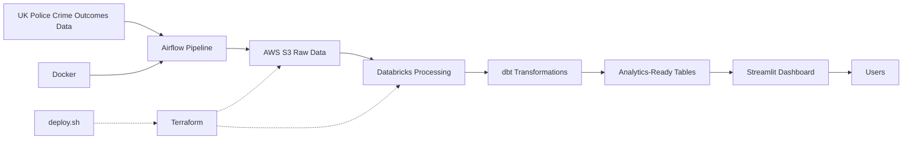
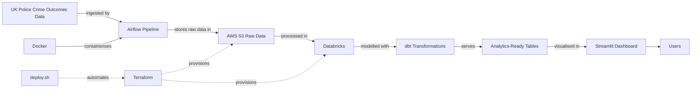

# sheffield-crime-outcomes
Data Zoomcamp Final Project Space (Batch)

Contents:
- Problem Statement 
- Project overview
- Infrastructure as code
  - Terraform
  - deploy.sh
- Orchestration
  - Airflow
  - Docker
  - app/ files
- Cloud
  - AWS
  - Databricks
- Transformations
  - DBT
- Dashboard
  - Streamlit
- Reproducibility Guide 

## Problem Description

Crime data in Sheffield provides valuable insights into patterns, locations, and outcomes of offences. However, this data is typically released as large, raw datasets that are not easily accessible or interpretable for non-technical users.

Users need a way to:

Explore crime trends over time
Compare different crime types and locations
Understand how crime outcomes vary across categories
Interact with data without requiring advanced analytical skills

This project addresses these challenges by transforming raw Sheffield crime data into an interactive dashboard, enabling users to explore patterns and outcomes through intuitive visualisations and filters.

## Project Overview

The dataset used in this project is sourced from the UK Police open data platform (https://data.police.uk/docs). The system is designed to ingest and store raw crime data in a scalable cloud environment, orchestrate data workflows through automated pipelines, and transform the data into structured, analytics-ready models. These processed datasets are then presented through an interactive dashboard, enabling users to explore crime patterns and outcomes in a clear and user-friendly way.

The project follows a modern data engineering architecture:

- Infrastructure as Code using Terraform to provision cloud resources
- Orchestration with Airflow and Docker to manage data pipelines
- Cloud storage and processing on AWS and Databricks
- Transformations implemented with DBT to create clean, reusable datasets
- Visualisation through a Streamlit dashboard for interactive analysis





The choice of tooling was influenced by the technologies used in my company, with the aim of gaining practical experience in these specific tools. As a result, this project incorporates tools such as Apache Airflow, AWS, and Databrick. As these were not covered in the course materials, additional effort has been made to explain and document these technologies.

## Infrastructure as code

The infrastructure for this project is managed using Terraform to make the cloud setup reproducible, version-controlled, and easier to deploy consistently. In this repository, Terraform is used to provision the core AWS and Databricks resources required for the pipeline, including an S3 bucket for raw data storage, public access restrictions on that bucket, an IAM policy and IAM role for secure access, a Databricks storage credential, and a Databricks external location for working with the data through Unity Catalog. The configuration is parameterised through variables so that deployment settings such as bucket names, AWS account details, role names, and Databricks resource names can be adapted without changing the main infrastructure code. Outputs are also defined to expose useful values after deployment, including the S3 bucket name, IAM role ARN, and the Databricks-generated external ID needed for the trust relationship.

### Terraform

The main Terraform configuration is defined in main.tf, with supporting variables in variables.tf, example environment-specific values in terraform.tfvars.example, and deployment outputs in outputs.tf. A notable part of this setup is the two-stage trust configuration between AWS and Databricks. The code first creates the AWS IAM role and Databricks storage credential using a bootstrap external ID, then updates the trust policy using the real external ID generated by Databricks, and finally creates the Databricks external location and grants the required permissions. This approach is necessary because the final trust configuration depends on a value that is only available after the initial Databricks resource has been created.

### deploy.sh

The deploy.sh script automates the Terraform deployment process so that the infrastructure can be created with fewer manual steps. The script first checks that Terraform is installed and that the required Databricks environment variables are available, then runs terraform init before carrying out a three-stage deployment. In stage one, it performs the bootstrap apply without creating the external location. It then reads the generated Databricks external ID from Terraform output, applies the updated IAM trust policy in stage two, waits briefly for IAM propagation, and finally runs a third apply to create the external location. This makes the deployment more reliable and reduces the risk of configuration errors when setting up the AWS–Databricks connection

## Orchestration

### Docker

### Airflow Dag

### app/ files

- ingest.py - takes data from https://data.police.uk/ API and loads to S3 bucket with simple partitions
- load_to_databricks.py - moves data from S3 to databricks

## 🚀 Reproducibility Guide

### ✅ Prerequisites

Make sure you have the following installed:

- Docker (with Docker Compose)
- Terraform
- Make (pre-installed on most macOS/Linux systems)
- An AWS account with credentials
- A Databricks workspace with:
  - SQL Warehouse
  - Access token

### 🔐 Environment Setup

Clone the repository:

```bash
git clone https://github.com/CaThY-988/sheffield-crime-outcomes.git
cd sheffield-crime-outcomes
```

Create your environment variables file:

```bash
cp .env.example .env
```

Update `.env` with your credentials:

```env
AWS_ACCESS_KEY_ID=...
AWS_SECRET_ACCESS_KEY=...
AWS_DEFAULT_REGION=eu-west-2
AWS_BUCKET_NAME=...

DATABRICKS_HOST=...
DATABRICKS_HTTP_PATH=...
DATABRICKS_TOKEN=...
```

---

### 🏗️ Provision Infrastructure (Terraform)

```bash
cd terraform
cp terraform.tfvars.example terraform.tfvars
# fill in required values
cd ..

set -a
source .env
set +a
bash terraform/deploy.sh
```

This will:
- Create an S3 bucket
- Configure Databricks external location and permissions

---

### ▶️ Run the Pipeline

Start all services and trigger the pipeline:

```bash
make run
```

This will:
- Start Airflow and Streamlit via Docker Compose
- Create an Airflow admin user (`admin / admin`)
- Unpause the DAG
- Trigger the pipeline

---

### 📊 Access the Interfaces

- **Airflow UI**: http://localhost:8080  
  Username: `admin`  
  Password: `admin`

- **Streamlit App**: http://localhost:8501  

---

### 🔍 Monitoring the Pipeline

**Airflow UI (recommended)**  
1. Open the DAG: `sheffield_crime_pipeline`  
2. Click on a task  
3. View logs to see detailed progress  

**Terminal logs**

```bash
make logs
```

---

### 🔄 Re-running the Pipeline

To trigger the pipeline again:

```bash
make trigger
```

---

### 🧹 Resetting the Environment (optional)

Stop all services:

```bash
make down
```

Full reset (including Airflow state):

```bash
docker compose down -v
```

---

### 🧠 Notes

- The pipeline is scheduled to run **monthly** via Airflow  
- `make run` performs an initial trigger for convenience  
- Future runs are handled automatically by Airflow  
- Task-level logs are available in the Airflow UI  
